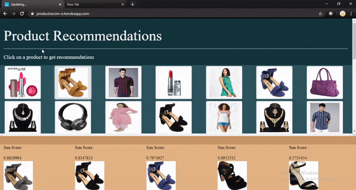

# product_recommendations

🎈 *Recommendation of products using transfer learning and cosine image similarity*🎀

👚👢  Online shopping websites always suggest items similar to the ones you have browsed and sometimes even items that can go with it. This project is a basic replication of the product recommendations using cosine image similarity and the transfer learning VGG16. The transfer learning model aids the project in feature extraction and furthermore also creates a matrix for the cosine similarity utility matrix.

The model generates good recommendations when tested even with a small dataset of only 5000 images. The VGG16 transfer learning model does the feature extraction process and cosine similarities prove to be useful yet again. The only downside is the computing time, as it takes a lot of time to process the images and generate predictions.

Furthermore, the accuracy of the model can be further enhanced by first introducing a content based filtering layer before feature extraction which will not generate recommendations from the same category. This can be done as it was observed that sometimes objects from different categories had a high similarity score.

For the User Interface, cloud computing services can be used to host the model and thus allow interaction with the model more rather than just statically generating recommendations and storing them which worked for a small-scale project prototype.

To run the project:

💎  Static (pre-trained, pre-stored results)) or 🚌  Dynamic

Clone the staticUI folder/UI folder from the repository and install all requirements from requirements.txt
run the app.py file 

Note: The dynamic UI takes longer as results are not pre-calculated.🔍
